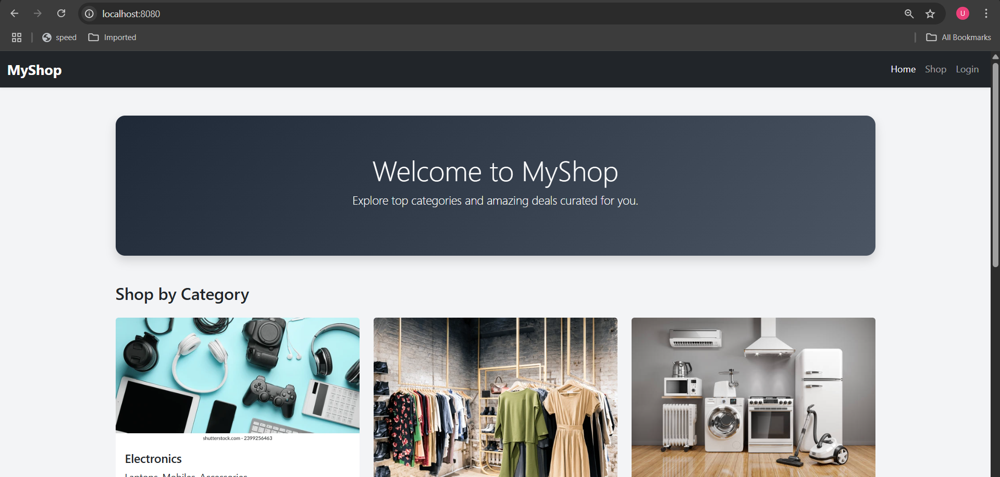
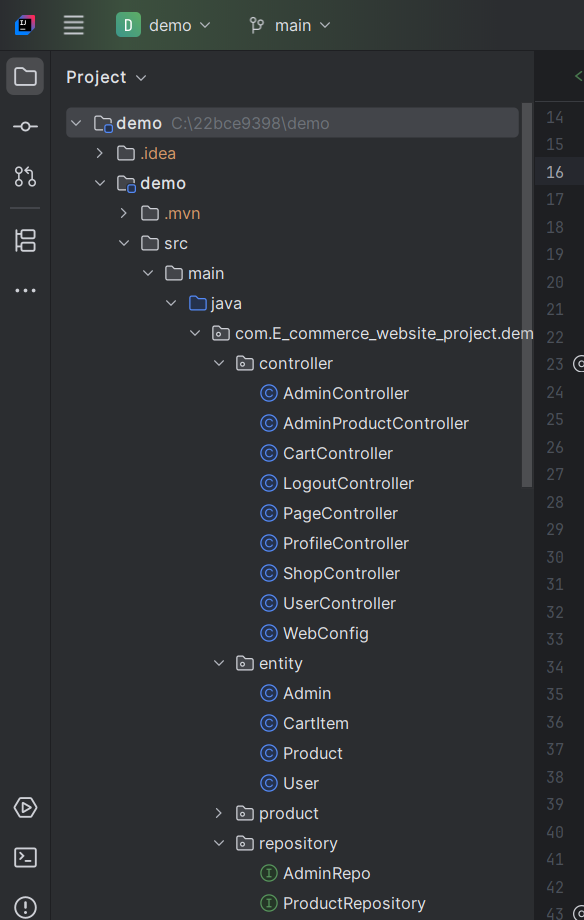
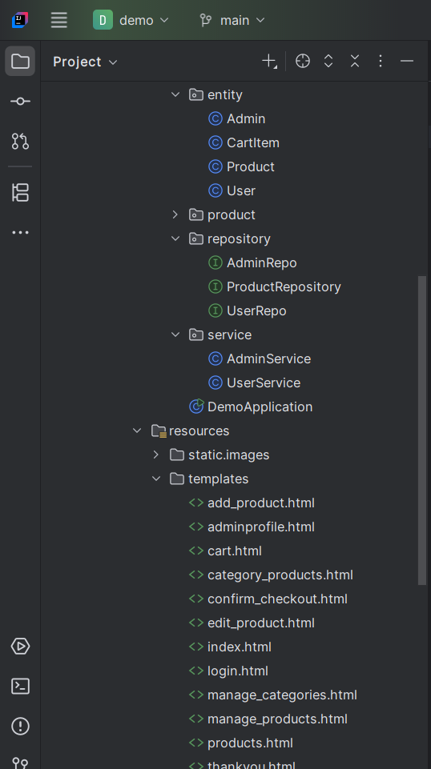

# springboot-shopping-website
Spring Boot Shopping Website  Developed a full-stack e-commerce application using Spring Boot, Thymeleaf, Hibernate (JPA), MySQL, and Bootstrap. Features include Admin/User roles, product and category management, image uploads, session-based cart, category-wise listing, and a simulated checkout flow.
# 🛒 Spring Boot Shopping Website

## 📸 Screenshots

### Homepage

### Project Structure in IntelliJ IDEA

### Project Structure in IntelliJ IDEA

A fully functional e-commerce shopping website built using **Spring Boot**, **Thymeleaf**, **MySQL**, **Hibernate (JPA)**, and **Bootstrap**.

## 🚀 Key Features

- 🔐 User Roles: Admin & User
- 🛍️ Product Management: Add, update, delete products
- 🗂️ Category Management: Category-wise product listing
- 🖼️ Product Image Upload & Storage
- 🛒 Session-Based Shopping Cart
- 🛒 User Shopping Flow: Add to cart, view cart, simulate checkout
- 📊 Admin Dashboard for Product & Category Management

## 🛠️ Technologies Used

- Java 17
- Spring Boot
- Spring MVC
- Hibernate (JPA)
- Thymeleaf (Template Engine)
- MySQL (Database)
- Bootstrap (Frontend Styling)
- Maven (Build Tool)

## 📁 Project Structure

- `/src/main/java` — Backend source code
- `/src/main/resources/templates` — Thymeleaf HTML templates
- `/src/main/resources/static` — Static resources (CSS, JS, images)
- `/static/images/productimages/` — Product images storage

## ⚙️ Setup Instructions

1. Clone this repository
2. Configure `application.properties` with your MySQL credentials
3. Build & Run using Maven or your IDE
4. Access the application at: `http://localhost:8080/`

## 💼 Admin Functionalities

- Add, edit, delete products
- Manage product categories
- View all products category-wise

## 👤 User Functionalities

- Browse products
- Add products to cart
- View cart & checkout (mock flow)

---

✅ This project can be extended to include:
- Payment integration (Stripe, Razorpay)
- User authentication & authorization (Spring Security)
- Order history & order

---

## 🎥 Demo Video

---
---

📌 **Developer:** Usman Khan  
📌 **GitHub:** [usmankhan616](https://github.com/usmankhan616)

---